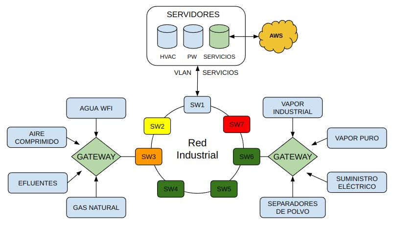

# Ejercicio CiberKillChain - Ataque

Haga una copia de este documto

## Alumno

Marcelo García

## Enunciado

Armar una cyberkillchain usando técnicas de la matriz de Att&ck para un escenario relacionado a tu trabajo práctico

## Datos trabajo práctico

El trabajo consiste en un Sistema de monitoreo de servicios de planta de bajo costo. Los nodos sensores se encuentran instalados en zonas apartadas de la planta donde se utiliza la tecnología LoRa / WiFi para tener acceso a los mismos.
Los nodos reportan a Gateways que se encunentran instalados en una red LAN industrial en la cual se dispone de una VLAN IoT exclusiva para estos dispositivos.
Se instala un Linux Server On premise donde se ejecuta el Backend, Frontend y base de datos de la aplicaciòn.
El servidor cuenta con un acceso a internet para la visualización de datos desde el exterior.
Se implementa en AWS una SPA para el acceso al sistema On Premise, donde el mismo solo permite el tráfico proveniente de AWS

## Resolución

### Reconnaissance

### Weaponization

### Delivery

### Exploitation

### Installation

### Command and control

### Actions on objectives

